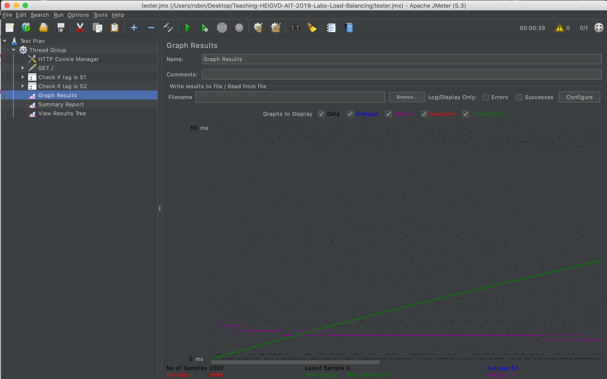

## Labo Load Balancing 

Authors: Cuénoud Robin, Dupont Maxime, Mulhauser Florian

## Pre-Task 1

I ran into some problems with the docker-compose

## Task 1

Deliverables:

Explain how the load balancer behaves when you open and refresh the URL http://192.168.42.42 in your browser. Add screenshots to complement your explanations. We expect that you take a deeper a look at session management.

Explain what should be the correct behavior of the load balancer for session management.

Provide a sequence diagram to explain what is happening when one requests the URL for the first time and then refreshes the page. We want to see what is happening with the cookie. We want to see the sequence of messages exchanged (1) between the browser and HAProxy and (2) between HAProxy and the nodes S1 and S2. Here is an example:

Sequence diagram for part 1

Provide a screenshot of the summary report from JMeter.

Run the following command:

$ docker stop s1
Clear the results in JMeter and re-run the test plan. Explain what is happening when only one node remains active. Provide another sequence diagram using the same model as the previous one.