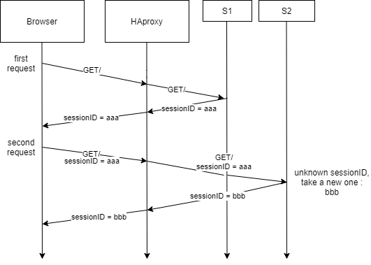
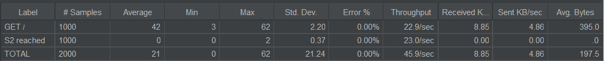
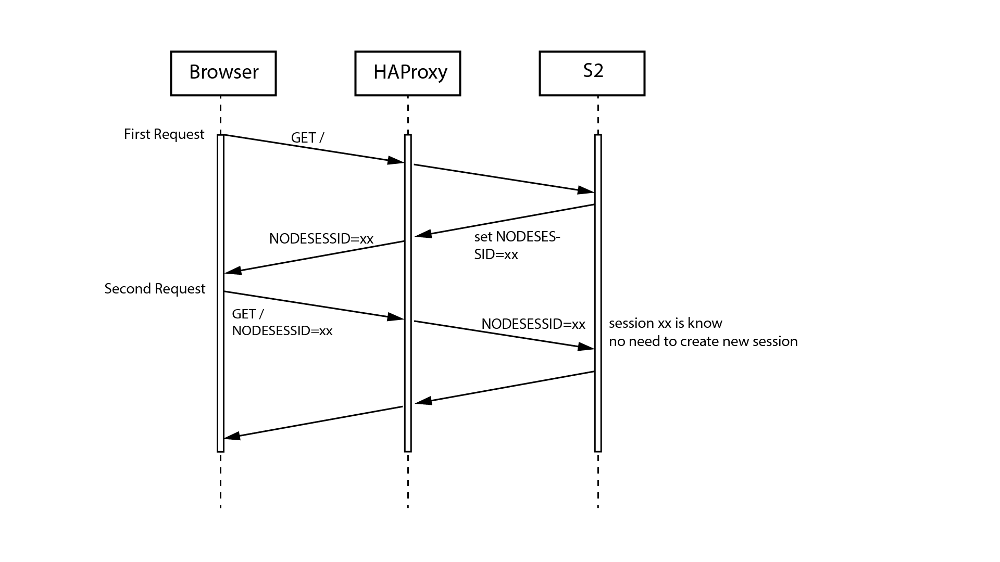

## Labo Load Balancing 

Authors: Cuénoud Robin, Dupont Maxime, Mulhauser Florian

## Introduction

## Pre-Task 1

I ran into some problems with the docker-compose ,   
I managed to fix them with the fix for windows after a while, I don't know why it wasn't working at first
or why it started working, my best guess is that I didn't create the `.gitattributes` file right.

I had to use the ip address `http://192.168.99.101:80` to get access to the load balancer, because I am using windows for this lab, and I can't directly access the containers (that IP is the IP of my VM running docker).

## Task 1 : Install the tools

#### Deliverables:

1. Explain how the load balancer behaves when you open and refresh the URL http://192.168.42.42 in your browser. Add screenshots to complement your explanations. We expect that you take a deeper a look at session management.

> When I refresh my browser, I can see that my request is handled by one server then another. That means the load-balancer is alternating between the 2 servers. That leads me to believe that the load-balancer is using a roundrobin policy.   
About session management, we can see that the session id changes everytime we refresh : 
>
>First time for our example :
>
>Now we refresh : 
  
We can see that the session id isnt the same, which makes sense because we are on another server, let's refresh one more time and see what happens :
 
So now we are back the the same server, but we can see that the session id isn't the same. Which means that the user has a new session with the same server, this isn't a problem as of now but it can become one depending on what we implement onto new servers. It is safe to say that as of right now, there is no session management (since we just create a new one everytime).

2. Explain what should be the correct behavior of the load balancer for session management.

> The load balancer should use sticky sessions, basically that mecanism is used by the load balancer to know if a session has been established between the client and a server beforehand, and thus the load balancer can route the client to the same server it has a session with.

3. Provide a sequence diagram to explain what is happening when one requests the URL for the first time and then refreshes the page. We want to see what is happening with the cookie. We want to see the sequence of messages exchanged (1) between the browser and HAProxy and (2) between HAProxy and the nodes S1 and S2. Here is an example:

> 

4. Provide a screenshot of the summary report from JMeter.

> 

5. Run the following command:

`$ docker stop s1`

Clear the results in JMeter and re-run the test plan. Explain what is happening when only one node remains active. Provide another sequence diagram using the same model as the previous one.

> Now what's happening is that the load balancer routes the requests to the only server that's working, s2, so since it already knows the session ID , and can keep the same session with one user. Thus sessionViews is correctly incremented (because we stay inside the same session instead of creating a new one everytime).
  
> We can see the JMeter results confirm the same thing we thought, every request is going to the same server. 
  
>Here is a new graph showing what happens now that s1 is down :
  
> Behaviour is mostly the same, except for the fact that we stay in the same session.

## Task 2: Sticky sessions

##### Deliverables:

1. There is different way to implement the sticky session. One possibility is to use the SERVERID provided by HAProxy. Another way is to use the NODESESSID provided by the application. Briefly explain the difference between both approaches (provide a sequence diagram with cookies to show the difference).
* Choose one of the both stickiness approach for the next tasks.  

2. Provide the modified haproxy.cfg file with a short explanation of the modifications you did to enable sticky session management.

3. Explain what is the behavior when you open and refresh the URL http://192.168.42.42 in your browser. Add screenshots to complement your explanations. We expect that you take a deeper a look at session management.

4. Provide a sequence diagram to explain what is happening when one requests the URL for the first time and then refreshes the page. We want to see what is happening with the cookie. We want to see the sequence of messages exchanged (1) between the browser and HAProxy and (2) between HAProxy and the nodes S1 and S2. We also want to see what is happening when a second browser is used.

5. Provide a screenshot of JMeter's summary report. Is there a difference with this run and the run of Task 1?

* Clear the results in JMeter.

* Now, update the JMeter script. Go in the HTTP Cookie Manager and uncheckverify that the box Clear cookies each iteration? is unchecked.

* Go in Thread Group and update the Number of threads. Set the value to 2.

7. Provide a screenshot of JMeter's summary report. Give a short explanation of what the load balancer is doing.

## Conclusion